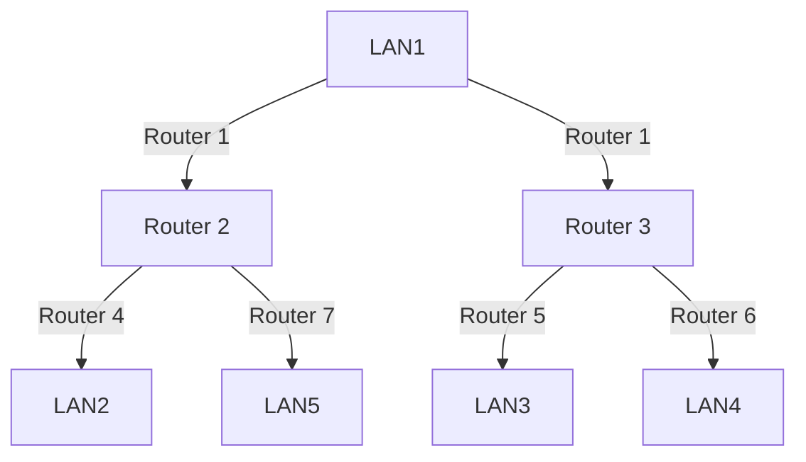

# WAN Topology Diagram

This document presents a comprehensive network topology diagram for WAN simulation using Mermaid.

## Network Topology Overview

The following diagram illustrates a WAN setup with 5 LANs connected through routers with static routing configuration.

## Static Routing Configuration

The following are the static routing configurations for each router:

- **Router 1**: Routes to LAN2, LAN3, LAN4, and LAN5
- **Router 2**: Routes to LAN1, LAN3, LAN4, and LAN5
- **Router 3**: Routes to LAN1, LAN2, LAN4, and LAN5
- **Router 4**: Routes to LAN1, LAN2, LAN3, and LAN5
- **Router 5**: Routes to LAN1, LAN2, LAN3, and LAN4
- **Router 6**: Routes to LAN1, LAN2, LAN3, and LAN5
- **Router 7**: Routes to LAN1, LAN2, LAN3, and LAN4
